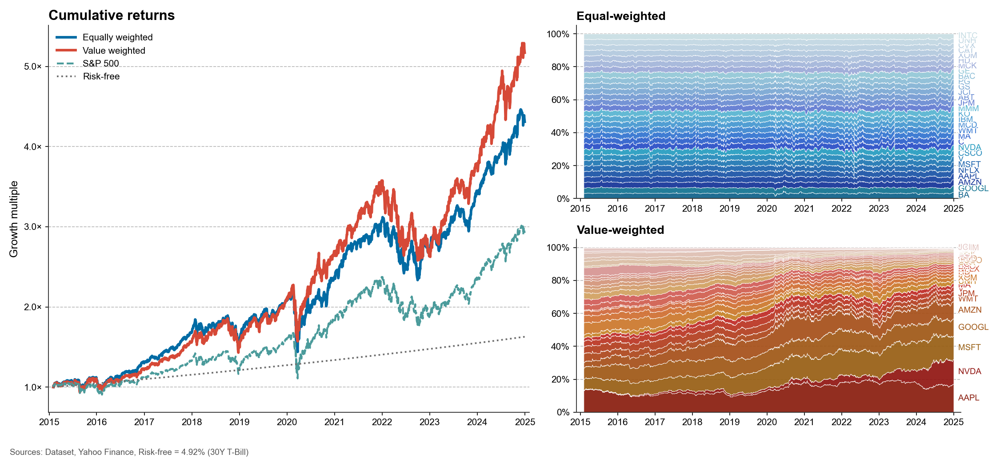
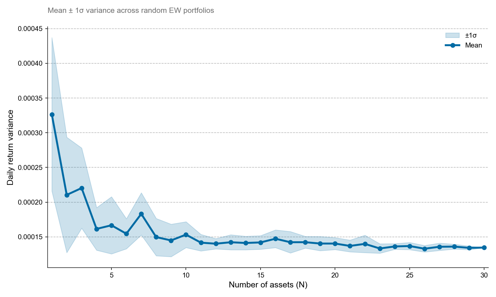

## Project Structure

- `clean_data/`: Contains the cleaned and processed data (converted to Parquet format for faster loading).
- `results/`: Stores the generated charts and analysis results.
- `data.py`: Data cleaning script to convert Excel data to Parquet format.
- `plots.py`: Code for generating and customizing charts.
- `project1.py`: Main script that performs the backtesting and calls functions to generate the charts.
- `requirements.txt`: List of dependencies for the project.

## Usage

- **Data Cleaning:** Run data.py to clean and prepare the data, converting it from Excel to Parquet format for faster access.

- **Backtesting & Chart Generation:** Run project1.py to perform portfolio backtesting and generate the charts.

- **Charts:** Once the backtest is completed, the charts will be saved in the results/ directory. Below are the charts you can expect:

